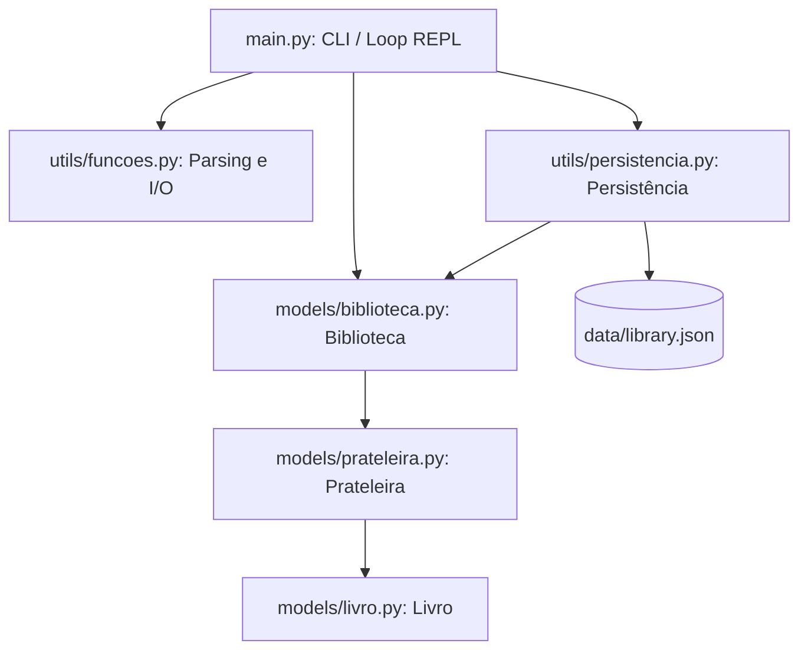
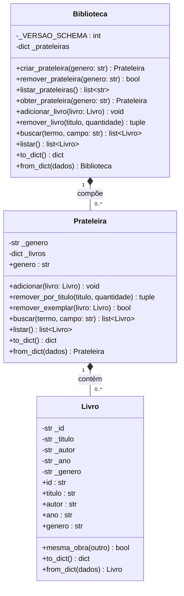
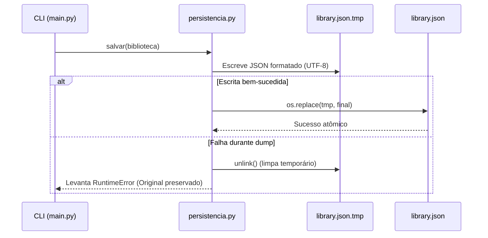

# Arquitetura do Sistema — biblioCLI

Documentação técnica da arquitetura, decisões de design, modelagem de dados e padrões estruturais do **biblioCLI**.

---

## 1. Visão Geral

O **biblioCLI** é uma aplicação de gerenciamento de acervo bibliotecário via linha de comando (CLI), desenvolvida como projeto integrador do **Bloco 1 — Orientação a Objetos** do programa [Diamond Forge](https://github.com/netojoseluizferreira-sys/diamond-forge).

O sistema prioriza:
- **Orientação a Objetos canônica**: alto encapsulamento, modelo de domínio rico e métodos especiais (*dunder methods*).
- **Separação estrita de responsabilidades (SoC)**: desacoplamento total entre domínio, persistência, interface do usuário e utilitários.
- **Persistência atômica e resiliente**: garantia de integridade contra falhas elétricas ou interrupções abruptas via escrita transacional.
- **Alta testabilidade**: isolamento de dependências com 99% de cobertura por testes automatizados.

---

## 2. Visão Estrutural e Camadas

A arquitetura adota uma organização em camadas bem delimitadas:

```
biblioCLI/
├── models/             # Camada de Domínio (Entidades e Regras de Negócio)
│   ├── livro.py        # Entidade Livro (Obra e Edição)
│   ├── prateleira.py   # Agrupamento homogêneo por gênero
│   └── biblioteca.py   # Aggregate Root (Composição de prateleiras)
├── utils/              # Camada de Suporte e Infraestrutura
│   ├── persistencia.py # Serialização e escrita atômica em JSON
│   └── funcoes.py      # Helpers de I/O de console e parsing de comandos
├── data/               # Armazenamento físico
│   └── library.json    # Base de dados em formato JSON
├── tests/              # Suíte de Testes Unitários (pytest)
├── docs/               # Documentação técnica e de testes
└── main.py             # Ponto de entrada e CLI (Controlador / Loop REPL)
```

### Diagrama de Camadas



---

## 3. Modelo de Domínio (`models`)

### 3.1. `Livro` (`models/livro.py`)
Representa tanto a obra quanto a sua edição específica no acervo:
- **Identidade e Imutabilidade**:
  - `id`: identifica a obra de forma imutável (apenas getter, sem setter).
  - `mesma_obra(outro)`: compara se dois livros compartilham o mesmo `id`, independentemente da edição ou ano.
  - `__eq__` e `__hash__`: consideram a tupla `(id, titulo)`. Dois livros são equivalentes se pertencem à mesma obra e edição. Permite o uso direto em `set` e como chaves de dicionário.
- **Encapsulamento e Validação**:
  - `titulo`, `autor` e `genero` utilizam `@property` e setters para garantir que não sejam strings vazias e aplicam normalização automática via `.title()`.
  - `ano`: suporta valores numéricos (`int` positivos para DC e negativos para AC) ou `str` (com parsing por expressão regular `^(\d+)\s*(AC|DC)?$`). Validações impedem o ano zero e anos na era DC superiores ao ano corrente.
- **Contrato de Serialização**:
  - `to_dict()` e `from_dict(dados)` fornecem mapeamento limpo de e para estruturas serializáveis em JSON.

### 3.2. `Prateleira` (`models/prateleira.py`)
Agrupa os livros de um gênero específico garantindo homogeneidade temática:
- **Estrutura de Armazenamento**:
  - Utiliza um `defaultdict(list)` com chaves compostas `(id, titulo) -> list[Livro]`.
  - O valor associado a cada chave é uma lista de instâncias de `Livro`, modelando fielmente múltiplos exemplares físicos da mesma edição.
- **Invariantes e Regras de Negócio**:
  - Rejeita a inserção de qualquer livro cujo `genero` não seja idêntico ao gênero normalizado da prateleira (`ValueError`).
  - `remover_por_titulo(titulo, quantidade)`: remove exemplares com opção de remoção total (`quantidade=None`) ou parcial limitada à cota informada.
  - `remover_exemplar(livro)`: remove uma instância específica baseada em igualdade de valor (`__eq__`).
  - `buscar(termo, campo)`: suporte a buscas parciais (*case-insensitive*) nos campos `titulo`, `autor`, `genero`, `id` e busca normalizada para `ano`.
- **Métodos Dunder**:
  - `__len__`: soma a contagem de todos os exemplares de todas as edições presentes na prateleira.
  - `__iter__`: permite iteração direta sobre todos os exemplares contidos.

### 3.3. `Biblioteca` (`models/biblioteca.py`)
Atua como o **Aggregate Root** (Raiz de Agregação) da arquitetura de domínio:
- **Composição**:
  - Gerencia um dicionário interno `dict[str, Prateleira]`, indexado pelo gênero normalizado.
- **Gerenciamento do Ciclo de Vida**:
  - Criação dinâmica de prateleiras: ao adicionar um livro via `adicionar_livro(livro)`, caso a prateleira daquele gênero não exista, ela é instanciada e registrada automaticamente.
  - Remoção segura: `remover_prateleira(genero)` recusa remover prateleiras que contenham exemplares (`len > 0`), prevenindo perda acidental de dados.
- **Operações Federadas**:
  - `remover_livro(titulo, quantidade)`: orquestra a remoção de exemplares com o mesmo título distribuídos entre prateleiras, respeitando o limite total cumulativo.
  - `buscar(termo, campo)`: agrega os resultados de busca de todas as prateleiras registradas.
- **Versionamento de Esquema**:
  - Atributo de classe `_VERSAO_SCHEMA = 1`. Na desserialização (`from_dict`), verifica se o JSON é compatível com a versão esperada, disparando `RuntimeError` caso contrário.

### Diagrama de Classes



---

## 4. Persistência de Dados (`utils/persistencia.py`)

A persistência do **biblioCLI** foi projetada para garantir **durabilidade** e **consistência** mesmo diante de falhas de execução:

### 4.1. Escrita Atômica (Atomic File Write)
A escrita direta em arquivos pode corromper dados se o processo for interrompido durante a gravação. O módulo implementa a técnica de substituição atômica:
1. Os diretórios pai do arquivo alvo são criados caso não existam (`mkdir(parents=True, exist_ok=True)`).
2. Os dados são gravados e descarregados em um arquivo temporário irmão (`<nome>.json.tmp`).
3. Uma vez concluída a escrita sem exceções, o arquivo temporário substitui o arquivo definitivo utilizando `os.replace()`, operação atômica a nível de sistema operacional no Linux e no Windows.
4. Caso ocorra erro durante a serialização, o arquivo `.tmp` é removido imediatamente, mantendo a versão anterior do arquivo original intacta.



### 4.2. Carregamento Seguro
- **Primeira execução**: se o arquivo JSON não existir, instancia uma `Biblioteca` vazia sem falhar.
- **Detecção de corrupção**: se o arquivo existir mas contiver JSON malformado, captura `json.JSONDecodeError` e levanta `ValueError` explícito.
- **Validação de esquema**: repassa para `Biblioteca.from_dict()`, que valida a compatibilidade de versão.

---

## 5. Interface de Linha de Comando (`main.py` e `utils/funcoes.py`)

### 5.1. Desacoplamento de Funções Utilitárias (`utils/funcoes.py`)
O módulo `funcoes.py` não importa nenhuma classe de domínio ou persistência, funcionando como uma biblioteca de helpers puros:
- `parse_comando(linha)`: decompõe entradas em tuplas `(comando, args)`.
- `pedir_int(msg, min, max)`: loop resiliente que trata erros de conversão e limites.
- `confirmar(msg)`: interpreta confirmações `s/n`.
- `imprimir_secao()`, `imprimir_lista_livros()` e `mostrar_ajuda()`: formatação visual uniforme de saída.

### 5.2. Loop REPL e Tolerância a Falhas (`main.py`)
- **Ciclo de Execução**: Loop interativo que lê a entrada, despacha para a função de comando correspondente (`cmd_add`, `cmd_rm`, `cmd_list`, `cmd_shelves`, `cmd_search`, `help`, `exit`/`quit`).
- **Política de Salvamento**:
  - Comandos que alteram o estado da biblioteca (`add`, `rm`) persistem imediatamente após a mutação em memória.
  - Ao encerrar voluntariamente (`exit`, `quit`), o acervo é salvo.
  - Sinais de interrupção (`KeyboardInterrupt` / Ctrl+C e `EOFError` / Ctrl+D) são capturados e tratados com salvamento garantido no bloco `finally`.

---

## 6. Decisões de Design e Padrões de Projeto

| Conceito / Padrão | Aplicação no biblioCLI | Benefício |
|---|---|---|
| **Aggregate Root** | `Biblioteca` controla o acesso às prateleiras e livros. | Centraliza regras globais, versionamento e busca cross-shelf. |
| **Encapsulamento Estrito** | Atributos privados (`_id`, `_titulo`, etc.) com `@property`. | Impede estados inválidos ou inconsistentes no domínio. |
| **Atomic File Replacement** | Escrita em `.tmp` seguida de `os.replace`. | Garante integridade transacional dos arquivos de dados. |
| **Separation of Concerns (SoC)** | `models` (negócio), `utils` (infra/I/O), `main` (CLI). | Código modular, de fácil manutenção e alta testabilidade. |
| **Fail-Fast** | Validações imediatas nos construtores e setters de entidades. | Erros são detectados no momento exato em que ocorrem. |
| **Dunder Methods Idiomáticos** | `__eq__`, `__hash__`, `__len__`, `__iter__`, `__str__`, `__repr__`. | Interoperabilidade natural com estruturas nativas do Python. |

---

## 7. Garantia de Qualidade e Cobertura de Testes

A arquitetura do **biblioCLI** foi projetada para viabilizar testes unitários sem necessidade de I/O em disco real nos testes de domínio:
- Todas as operações em `persistencia.py` aceitam caminhos arbitrários (`Path`), permitindo o uso da fixture `tmp_path` do pytest.
- Módulos de interface são desacoplados por injeção de dependência e podem ser testados com `monkeypatch` e `capsys`.
- **Cobertura total**: 99% com 95 testes unitários automatizados (detalhes em [`docs/testes.md`](testes.md)).
